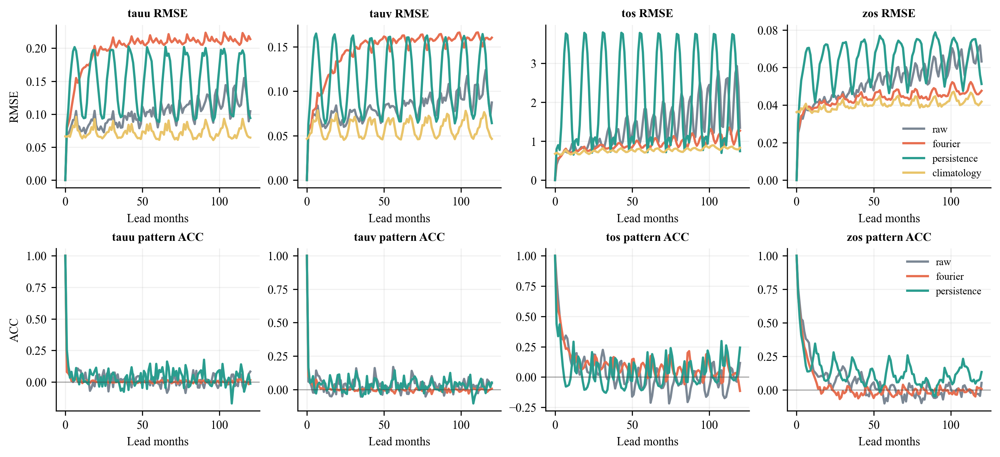
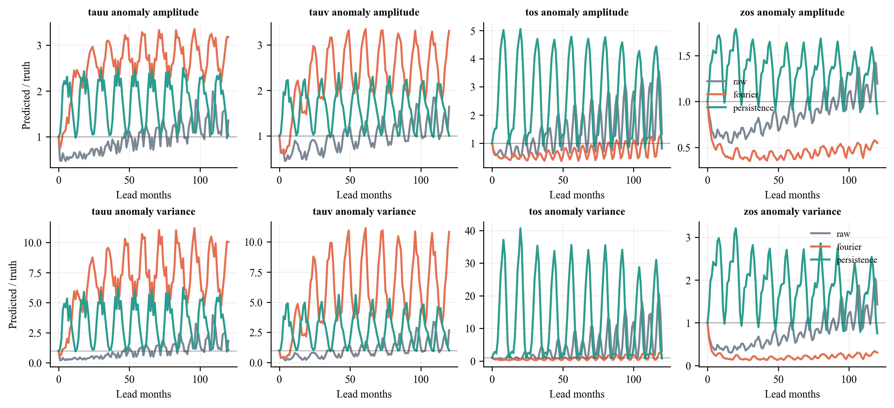
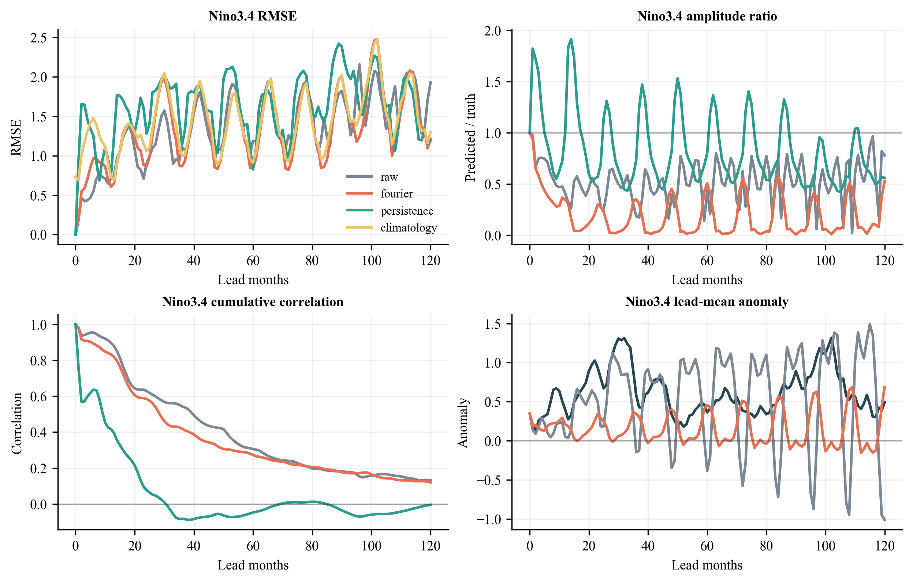
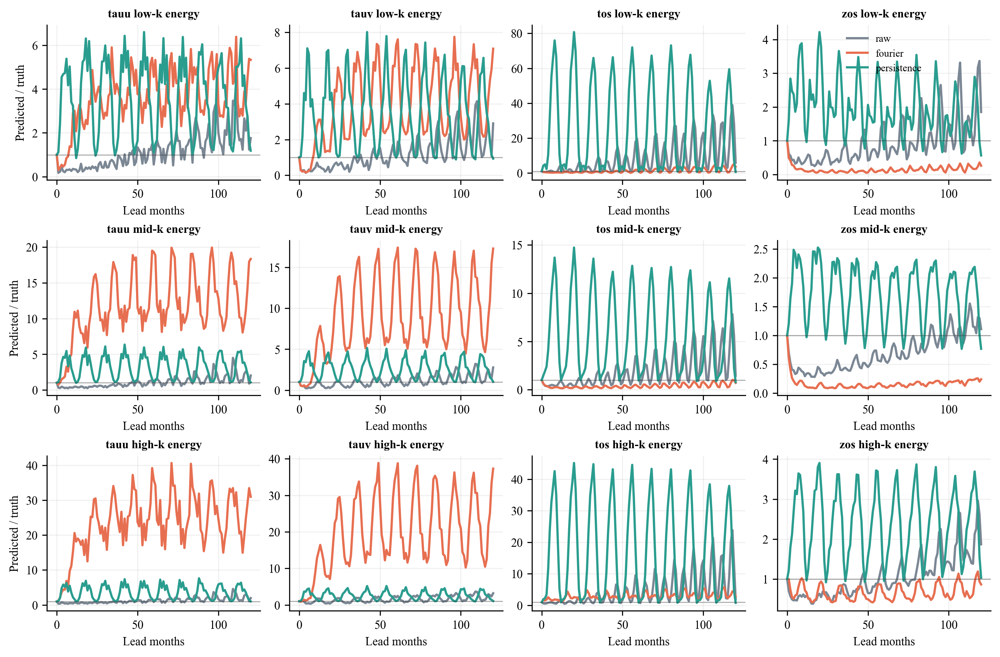

<p align="center">
  
</p>

# steadysky-fourier

**A low-to-high Fourier curriculum for long-rollout stability in weather and climate models.**

Most neural weather models learn to step forward in time, then are asked to keep walking far beyond the horizon where they were trained. In long autoregressive rollouts, small errors can accumulate, spectra can drift, seasonal structure can fade, and fields can eventually leave the climate they came from.

This repository explores a simple idea:

> Let the model first learn the slow music of the system, then gradually return the faster notes.

We do not change the model architecture. We change only the order in which the training data is shown.

## The Idea

The intervention is a **training data injection curriculum**:

1. Transform each training time series into the temporal Fourier domain.
2. Reconstruct low-pass versions of the training data.
3. Train first on low-frequency dynamics.
4. Add higher-frequency temporal modes cumulatively.
5. Finish training on the original raw data.

The baseline sees raw data for the same total number of optimizer updates.

## Experimental Rule

Every formal comparison keeps these fixed:

- model architecture
- loss function
- optimizer and scheduler
- train/validation/test split
- normalization statistics
- total training budget
- evaluation protocol

Only the training data schedule differs.

## Phase 1

The first controlled test uses **SFNO / FourCastNet2 via NVIDIA Makani** on four 1-degree gridded variables:

- `tauu`
- `tauv`
- `tos`
- `zos`

| Arm | Model | Data schedule |
|---|---|---|
| Raw baseline | `sfno_walker_1deg_edim384_layers8` | raw data throughout |
| Fourier curriculum | `sfno_walker_1deg_edim384_layers8` | low-pass stages, then raw |

The Phase 1 model has **147,776,272 trainable parameters** under Makani's parameter-counting convention, which counts complex-valued spectral weights by their real-valued entries.

## Curriculum

The Fourier arm uses a growing low-pass schedule:

| Stage | Data | Interpretation | Epochs |
|---:|---|---|---:|
| 1 | `train_lp004` | very low temporal frequencies | 10 |
| 2 | `train_lp008` | slightly richer low-frequency dynamics | 15 |
| 3 | `train_lp016` | medium-low temporal structure | 20 |
| 4 | `train_lp032` | broader temporal variability | 25 |
| 5 | `train_lp064` | more high-frequency temporal content | 35 |
| 6 | `train_raw` | full original data | 45 |

Total: **150 epochs**.

The raw baseline is split into the same cumulative epoch endpoints, but every stage uses `train_raw`. This keeps the total training budget aligned.

## Batch And Launch

Phase 1 currently launches Makani with one process and global batch 16:

```text
STEADYSKY_NPROC_PER_NODE=1
STEADYSKY_BATCH_SIZE=16
```

The one-process path is used because the two-process launcher failed before training on the current machine. Batch 16 was selected after short real train+validation capacity probes; batch 24 OOMed.

## Evaluation

Training-time validation is only a health check. It uses a short autoregressive rollout so that training does not spend most of its time evaluating.

The actual research claim is evaluated after training with long rollouts:

- blow-up time
- mean and variance drift
- loss of seasonal or low-frequency structure
- small-scale spectral energy ratio
- short-horizon skill sanity checks

This is inspired by long-rollout stability benchmarks such as *Can AI Weather Models Predict Beyond Two Weeks? A Quantitative Benchmark and Analysis of Long Rollouts*, but this repository is not a full ERA5 benchmark reproduction. Phase 1 is a controlled four-variable test of the data-injection idea.

## Phase 1 Diagnostics

The first 150-epoch SFNO comparison is deliberately interpreted as a **skill-vs-smoothing diagnostic**, not as a finished proof that Fourier curriculum improves long-range forecasting.

The Fourier curriculum reduces some long-horizon RMSE values relative to the raw baseline, but the diagnostic plots show a more cautious story: pattern correlation does not consistently improve, Nino3.4 phase skill remains weak at long leads, and anomaly amplitude can be suppressed. In other words, part of the apparent stability gain may come from smoothing or attractor regularization rather than better long-range dynamics.

| Diagnostic | What It Tests |
|---|---|
| RMSE and pattern ACC | Whether lower error also preserves spatial phase and structure |
| Anomaly amplitude and variance ratio | Whether predictions collapse toward a smoother climatological state |
| Nino3.4 skill and amplitude | Whether ENSO-like regional anomalies are tracked or damped |
| Spectral energy ratios | Whether low-, mid-, and high-wavenumber energy are retained |









The current takeaway is modest: **Fourier layerwise training appears to change long-rollout error geometry, but the first run does not yet demonstrate strong long-range predictive skill.**

## Data And Artifacts

This repository stores code, configs, protocols, and lightweight metadata only. It does not store source NetCDF files, generated HDF5 datasets, checkpoints, or rollout outputs.

Use environment variables for machine-specific paths:

```bash
export STEADYSKY_SOURCE=/path/to/source/netcdf
export STEADYSKY_WORK=/path/to/working/directory
```

Prepare Makani-format data:

```bash
python scripts/prepare_walker_makani_full.py \
  --source-root "$STEADYSKY_SOURCE" \
  --output-root "$STEADYSKY_WORK/data/walker_ocean_1deg_full"
```

Create Fourier curriculum stages:

```bash
python scripts/make_fourier_curriculum_stages.py \
  --dataset-root "$STEADYSKY_WORK/data/walker_ocean_1deg_full" \
  --cutoffs 4,8,16,32,64
```

Check the launch plan:

```bash
bash scripts/launch_phase1_pair.sh --dry-run
```

Run the paired Phase 1 training:

```bash
bash scripts/launch_phase1_pair.sh
```

The paired launcher runs readiness checks and a Makani smoke test before training, then runs the raw baseline followed by the Fourier curriculum. Lower-level scripts are kept for diagnostics and documented in `docs/phase1_launch_manifest.md`.
