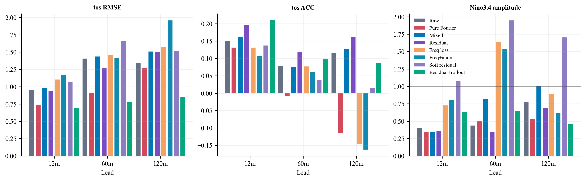
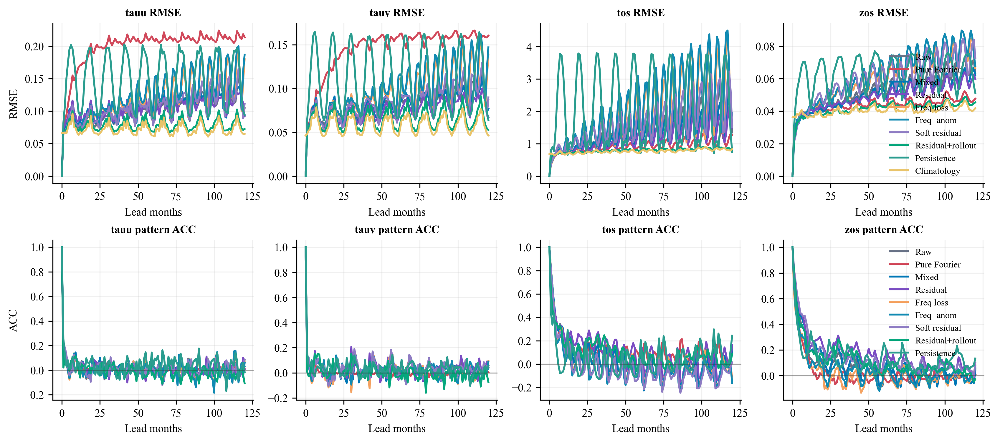
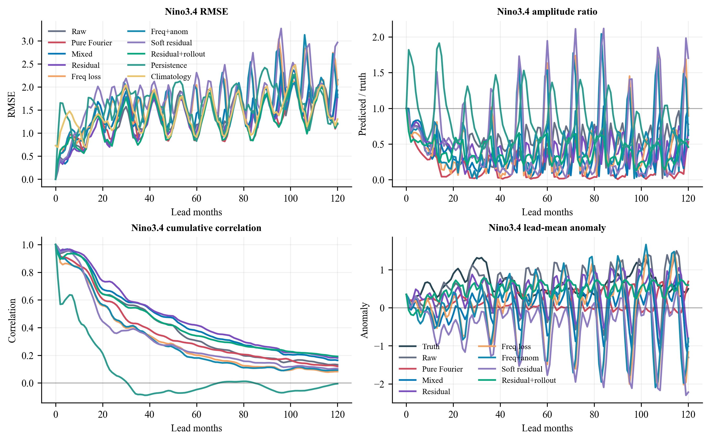
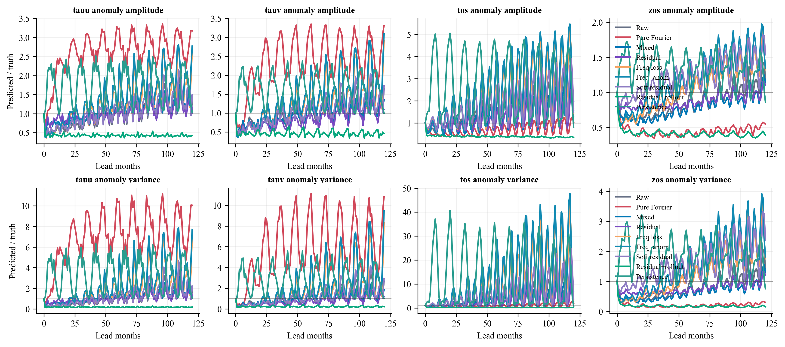
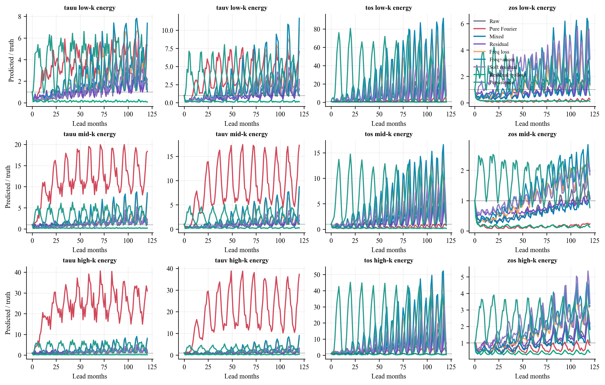

# Phase 4 Residual Rollout Results

Phase 4 tested whether the best Phase 2 direction could be improved by making
the residual curriculum softer, and by adding short autoregressive rollout
training in the later curriculum stages.

The architecture, variables, split, optimizer family, 150-epoch budget, and
120-month rollout evaluation are kept aligned with the previous SFNO Makani
runs. The evaluated model is still `sfno_walker_1deg_edim384_layers8`
with 147,776,272 trainable parameters.

## Arms

| Arm | Training schedule | Rollout training |
|---|---|---|
| `phase4_residual_soft_edim384` | soft residual curriculum, then raw | no |
| `phase4_residual_rollout_edim384` | same soft residual curriculum, then raw | stages 4-6 use multistep counts 3, 6, 12 |

Both arms completed the full 150-epoch schedule and the 120-month rollout
evaluation.

## Training Loss

| Arm | Final train loss | Final validation loss |
|---|---:|---:|
| Soft residual | 0.00110 | 0.12691 |
| Residual+rollout | 0.000534 | 0.13610 |

Training loss alone is not interpreted as the research result. The claim must
come from the long rollout diagnostics.

## Key 120-Month Rollout Metrics

The table below reports tos skill at 12, 60, and 120 months, plus 120-month
Nino3.4 diagnostics. Lower RMSE is better. Higher ACC is better. An amplitude
ratio near 1 means the predicted anomaly magnitude is close to the truth.

| Method | tos RMSE 12m | tos RMSE 60m | tos RMSE 120m | tos ACC 120m | Nino3.4 RMSE 120m | Nino3.4 amp 120m |
|---|---:|---:|---:|---:|---:|---:|
| Raw | 0.950 | 1.405 | 1.345 | 0.116 | 1.928 | 0.777 |
| Pure Fourier | 0.742 | 0.908 | 1.270 | -0.115 | 1.212 | 0.529 |
| Mixed | 0.979 | 1.436 | 1.507 | 0.128 | 2.158 | 1.004 |
| Residual | 0.935 | 1.265 | 1.497 | 0.162 | 1.839 | 0.695 |
| Freq loss | 1.104 | 1.458 | 1.577 | -0.146 | 2.053 | 0.893 |
| Freq+anom | 1.169 | 1.412 | 1.956 | -0.162 | 1.777 | 0.620 |
| Soft residual | 1.063 | 1.660 | 1.521 | 0.015 | 2.968 | 1.703 |
| Residual+rollout | 0.695 | 0.778 | 0.848 | 0.087 | 1.211 | 0.455 |
| Persistence | 0.655 | 0.719 | 0.744 | 0.243 | 1.193 | 0.560 |
| Climatology | 0.696 | 0.758 | 0.832 | - | 1.304 | - |

At 120 months, the residual+rollout arm substantially reduces tos RMSE
relative to raw, pure Fourier, Phase 2 residual, and both Phase 3 arms.
However, it still does not beat persistence on tos RMSE or tos ACC, and it is
slightly worse than climatology on tos RMSE. Its Nino3.4 RMSE is close to
persistence and pure Fourier, but its Nino3.4 amplitude ratio is only 0.455.

## Cross-Variable 120-Month Snapshot

Each cell is `RMSE / ACC / amplitude ratio`.

| Method | tauu | tauv | tos | zos |
|---|---:|---:|---:|---:|
| Raw | 0.104 / 0.082 / 1.356 | 0.087 / 0.046 / 1.640 | 1.345 / 0.116 / 1.327 | 0.063 / 0.053 / 1.194 |
| Residual | 0.092 / 0.009 / 1.020 | 0.067 / 0.042 / 1.094 | 1.497 / 0.162 / 1.658 | 0.060 / 0.073 / 1.104 |
| Soft residual | 0.111 / 0.087 / 1.490 | 0.090 / 0.055 / 1.714 | 1.521 / 0.015 / 1.489 | 0.073 / 0.100 / 1.538 |
| Residual+rollout | 0.073 / -0.107 / 0.423 | 0.053 / -0.074 / 0.466 | 0.848 / 0.087 / 0.351 | 0.045 / -0.028 / 0.395 |
| Persistence | 0.094 / -0.013 / 1.028 | 0.064 / 0.053 / 1.001 | 0.744 / 0.243 / 0.814 | 0.051 / 0.134 / 0.866 |
| Climatology | 0.064 / - / - | 0.046 / - / - | 0.832 / - / - | 0.042 / - / - |

Residual+rollout lowers long-lead RMSE for several variables, but the
corresponding ACC and amplitude ratios show that this is largely a damping
effect. The model remains numerically stable, but much of the anomaly energy is
suppressed.

## Interpretation

Phase 4 is not a positive proof of the original claim. It is a useful boundary
result:

- Soft residual training alone does not help; it worsens tos RMSE and Nino3.4.
- Adding rollout training strongly stabilizes the model and lowers long-lead
  RMSE.
- The residual+rollout gain is not clean long-range skill because pattern ACC
  remains weak and anomaly amplitude collapses.
- The best Phase 4 arm is therefore closer to a stable damped forecaster than
  a model that preserves the underlying long-period dynamics.

The next improvement should preserve the rollout-training benefit while adding
an explicit constraint against anomaly collapse, for example an anomaly-energy
or spectral-energy regularizer applied during the rollout stages.

## Figures

