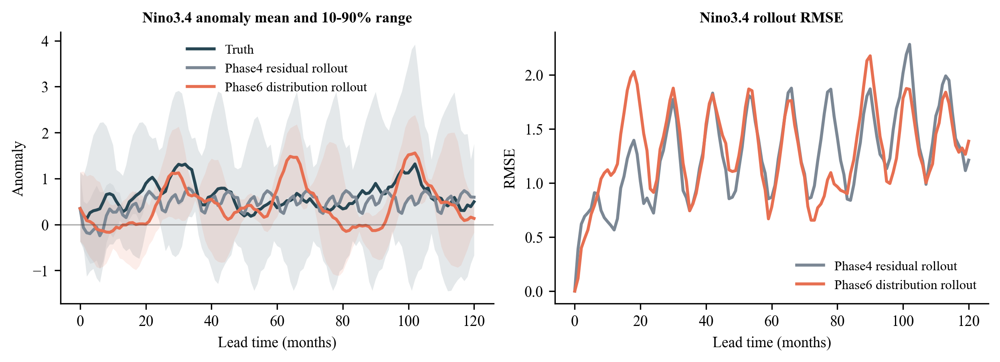
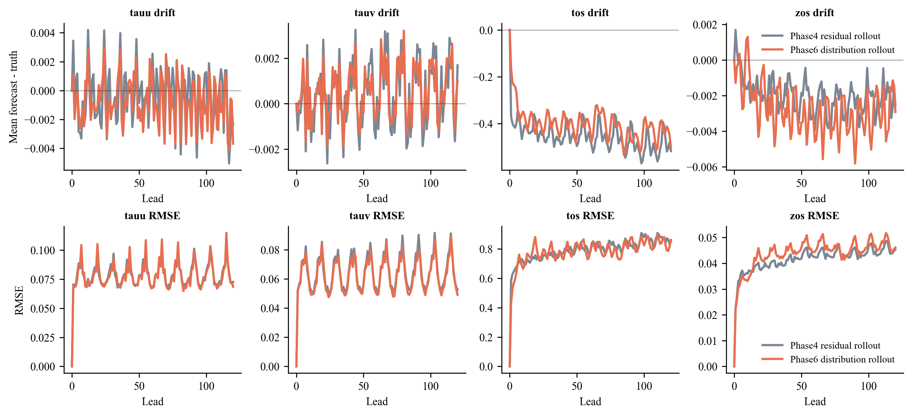
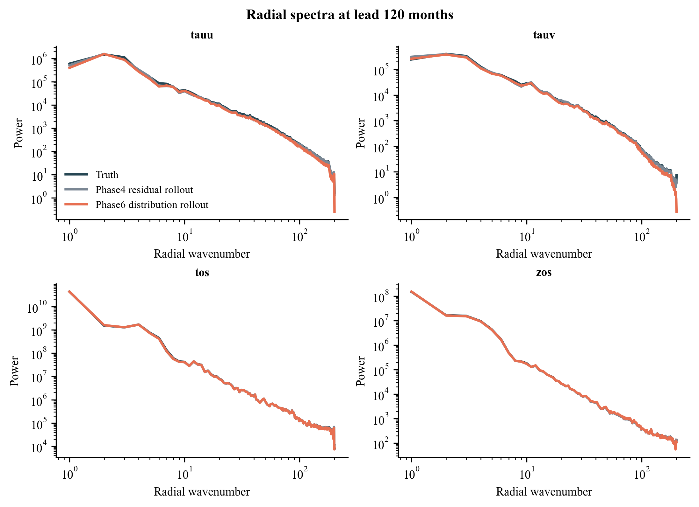

# Phase 6 Attractor And Distribution Results

Phase 6 completed both 150-epoch arms and the 120-month post-training rollout
evaluation.

## Formal Makani Rollout Metrics

These values are from the Makani inference logs at 120-month lead
(`87600` hours). Lower RMSE/CRPS is better. ACC values here follow Makani's
logged convention and are used comparatively within the same evaluation path.

| Arm | tos RMSE | tos ACC | tos ACC AUC | tos CRPS | zos RMSE | tauu RMSE | tauv RMSE |
|---|---:|---:|---:|---:|---:|---:|---:|
| Raw baseline | 1.2134 | 6.4593 | 7.1110 | 0.8532 | 0.0568 | 0.0966 | 0.0810 |
| Phase 4 residual+rollout | 0.7416 | 9.3691 | 9.4803 | 0.4900 | 0.0393 | 0.0662 | 0.0462 |
| Phase 5 spectrum rollout | 0.7430 | 9.4249 | 9.4712 | 0.5040 | 0.0531 | 0.0663 | 0.0468 |
| Phase 5 energy rollout | 0.7844 | 9.0150 | 8.9833 | 0.5357 | 0.0400 | 0.0684 | 0.0468 |
| Phase 6A attractor rollout | 0.7695 | 9.0986 | 9.1473 | 0.5192 | 0.0388 | 0.0667 | 0.0461 |
| Phase 6B distribution rollout | **0.7375** | **9.4922** | **9.5882** | **0.4818** | **0.0385** | **0.0601** | **0.0421** |

The surprising result is that Phase 6B beats Phase 4 on the formal long-lead
Makani metrics, even though its training validation loss looked less healthy
than Phase 6A. This suggests that the batch-level distribution constraint is
doing something useful for the rollout attractor that is not captured by the
short training validation loss.

## Diagnostic Read

The diagnostic figures compare Phase 6B against Phase 4 using saved forecast
fields. These diagnostics use a separate masked-field/Nino3.4 analysis path, so
their RMSE values should be interpreted as supporting diagnostics rather than
the formal Makani metric table above.

At the 120-month lead:

| Diagnostic | Phase 4 | Phase 6B | Read |
|---|---:|---:|---|
| Nino3.4 trajectory std, leads 1-120 | 0.2881 | 0.8492 | Phase 6B restores much more anomaly amplitude |
| Truth Nino3.4 trajectory std, leads 1-120 | 1.3507 | 1.3507 | both remain damped versus truth |
| Nino3.4 RMSE at 120 months | 1.2110 | 1.3857 | Phase 6B amplitude recovery does not yet imply regional phase skill |
| tos masked diagnostic RMSE at 120 months | 0.8484 | 0.8603 | roughly similar, Phase 6B slightly worse in this diagnostic |
| tos drift at 120 months | -0.5174 | -0.5012 | both retain a cold/negative drift; Phase 6B is slightly less negative |

## Interpretation

Phase 6A did not solve the collapse problem. Its Nino3.4 trajectory standard
deviation is almost identical to Phase 4, so per-sample mean/variance/covariance
matching was too local or too weak to move the long-rollout attractor.

Phase 6B is more promising. It improves the formal Makani 120-month metrics and
recovers a meaningful amount of Nino3.4 amplitude without causing obvious
high-wavenumber spectral explosion. But it still does not establish long-range
phase skill: the recovered anomalies can be mistimed or regionally misplaced,
which shows up in Nino3.4 RMSE.

The updated conclusion is therefore:

> Distribution-level constraints are a better direction than direct Fourier
> band losses or per-sample attractor statistics, but Phase 7 must add a
> mechanism that links distributional realism to trajectory consistency.

## Phase 7 Consequence

Phase 7 should prioritize the closed-loop direction in
`docs/phase7_closed_loop_plan.md`.

Recommended order:

1. Launch Phase 7B teacher-anchored rollout first if implementation cost is
   acceptable, because Phase 6B restored distributional amplitude but still
   lacks local phase anchoring.
2. Launch Phase 7A cycle consistency second, because it is the cleaner
   mathematical continuation for irreversible low-frequency collapse, but it
   may be harder to implement faithfully in the existing Makani training path.

The immediate optimization target is no longer just "more energy". It is:

> Preserve the invariant-distribution benefit of Phase 6B while improving
> short-to-medium lead trajectory anchoring, especially for Nino3.4 phase.
