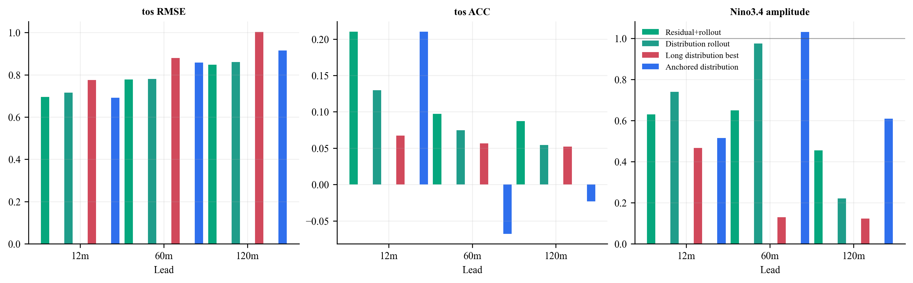
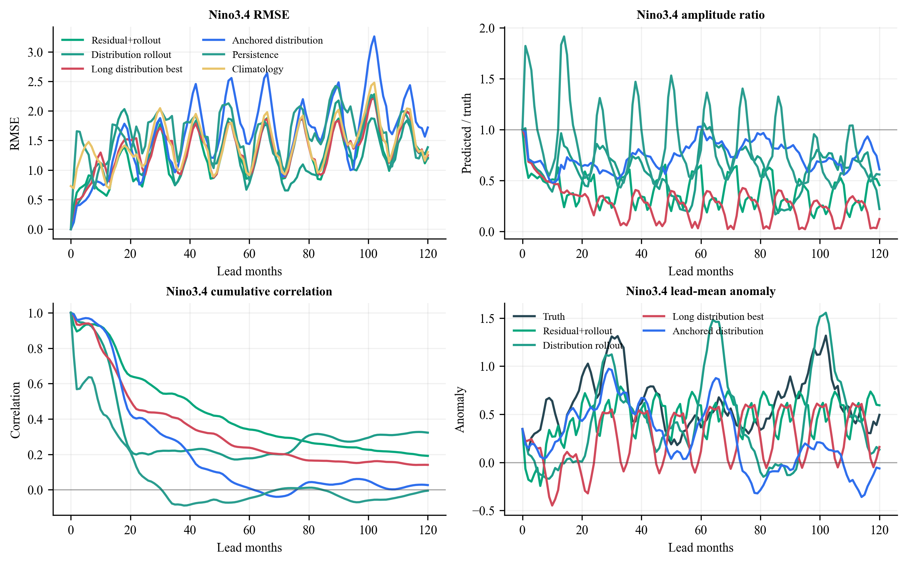
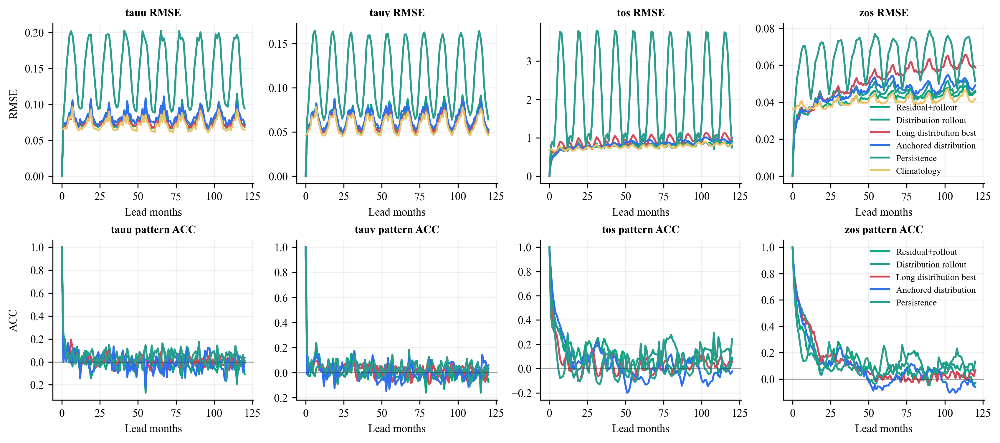
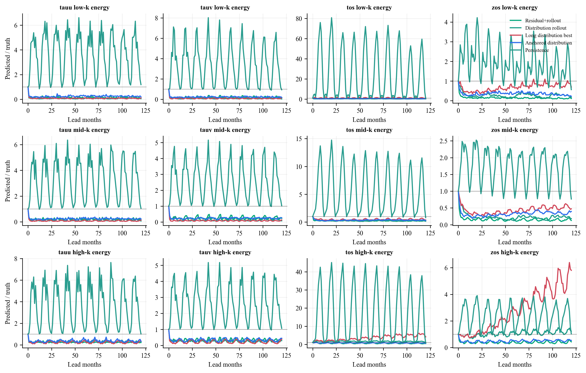

# Phase 7 Distribution Rollout Results

Phase 7 tested two architecture-fixed follow-ups to the Phase 6B distribution
rollout result.

| Arm | Run number | Mechanism | Training outcome |
|---|---|---|---|
| Phase 7A long distribution rollout | `phase7_long_distribution_rollout_edim384` | Phase 6B distribution loss with rollout exposure extended up to 24 steps | Stage 6 became non-finite; final checkpoint is rejected |
| Phase 7A best checkpoint | `phase7_long_distribution_rollout_best_edim384` | Isolated evaluation of the pre-NaN `best_ckpt_mp0.tar` | Stable enough for evaluation, but worse than Phase 6B |
| Phase 7B anchored distribution rollout | `phase7_anchored_distribution_rollout_edim384` | Phase 6B distribution loss plus a short-lead pointwise field anchor | Completed all 150 epochs |

## Formal Makani Rollout Metrics

These values are from the 120-month Makani inference logs at `87600` hours.
Lower RMSE/CRPS is better. ACC is used comparatively within the same Makani
evaluation path.

| Arm | tos RMSE | tos ACC | tos CRPS | Read |
|---|---:|---:|---:|---|
| Phase 4 residual+rollout | 0.7416 | 9.3691 | 0.4900 | Stabilizing baseline |
| Phase 6B distribution rollout | **0.7375** | **9.4922** | **0.4818** | Best current arm |
| Phase 7A long distribution, final | NaN | NaN | NaN | Reject: non-finite stage 6 |
| Phase 7A long distribution, best checkpoint | 0.8628 | 9.0205 | 0.6067 | Pre-NaN checkpoint is still worse |
| Phase 7B anchored distribution | 0.8103 | 8.8920 | 0.5375 | Stable training, worse long rollout |

## Diagnostic Read

The supporting diagnostics compare saved forecast fields from Phase 4,
Phase 6B, Phase 7A best, and Phase 7B. These values use the repository's
masked-field/Nino3.4 path, so they should be read as diagnostic geometry rather
than replacements for the formal Makani table.

At 120 months:

| Diagnostic | Phase 4 | Phase 6B | Phase 7A best | Phase 7B |
|---|---:|---:|---:|---:|
| tos diagnostic RMSE | 0.8484 | 0.8603 | 1.0024 | 0.9153 |
| tos diagnostic ACC | 0.0874 | 0.0543 | 0.0522 | -0.0231 |
| tos anomaly amplitude ratio | 0.3506 | 0.4070 | 0.7858 | 0.4676 |
| Nino3.4 RMSE | 1.2110 | 1.3857 | 1.2520 | 1.7195 |
| Nino3.4 amplitude ratio | 0.4554 | 0.2209 | 0.1228 | 0.6093 |
| Nino3.4 cumulative correlation | 0.1916 | 0.3226 | 0.1407 | 0.0266 |

## Interpretation

Phase 7A is a useful negative result. Extending distribution-matched rollout
exposure to 24 steps made the final raw stage numerically unstable. The
pre-NaN best checkpoint did not rescue the idea: it preserved more field
amplitude in some diagnostics, but its formal 120-month `tos` RMSE and CRPS
were much worse than Phase 6B.

Phase 7B is also negative, but for a different reason. The short-lead field
anchor did keep training finite and gave reasonable short-to-mid lead behavior,
yet it did not improve the long-run attractor. At 120 months it worsened the
formal `tos` metrics and nearly erased the Nino3.4 cumulative correlation in
the diagnostic path.

The updated conclusion is:

> Phase 6B remains the best current mechanism. More rollout exposure and
> short-lead anchoring are not sufficient; the next phase should constrain
> long-run invariant structure directly rather than adding more local forecast
> pressure.

## Phase 8 Consequence

Phase 8 should move away from stronger pointwise anchors and toward losses or
curricula that preserve long-run climate invariants:

- seasonal-cycle consistency over closed-loop rollouts,
- low-order spatial moment and basin-mean drift constraints,
- spectral-shape constraints that are weak enough not to dominate phase skill,
- Nino3.4/ENSO-band diagnostics as selection metrics rather than only final
  visualizations.
